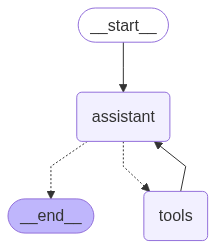

# Technical Analyst Agent with LangChain and Qandle AI



## Overview

This example demonstrates how to build an intelligent technical analyst agent that combines the conversational capabilities of LangChain with the real-time financial intelligence of Qandle AI. The agent can analyze stock symbols and provide comprehensive technical analysis reports on demand.

## How It Works

The agent follows a simple but powerful workflow:

1. **Human Input**: The assistant receives a message from the user (e.g., "What is the price of AAPL?")
2. **Tool Decision**: The LLM analyzes the request and decides whether to use external tools
3. **Tool Execution**: If needed, the agent calls Qandle AI to retrieve pre-computed technical analysis data
4. **Response Generation**: The AI processes the tool results and provides a comprehensive answer

## Key Advantage

Unlike traditional approaches that require LLMs to calculate financial metrics in real-time, this agent leverages Qandle AI's pre-computed financial intelligence. This ensures accurate, up-to-date technical analysis without the computational overhead or potential errors of LLM-based calculations.

## Getting Started

### Option 1: Jupyter Notebook
Follow the step-by-step tutorial in `agent.ipynb` to understand how the agent is built and test it interactively.

### Option 2: LangGraph Studio
Deploy and experiment with the agent using LangGraph Studio:

```bash
cd studio/
# Copy the example environment file and adapt it with your credentials
cp .env.example .env
pip install -r requirements.txt
npx @langchain/langgraph-cli dev --tunnel
```

Then open the project in LangGraph Studio to visualize and interact with the agent graph.

## Prerequisites

- Python 3.8+
- Qandle AI API key
- Ollama running locally (for the LLM)